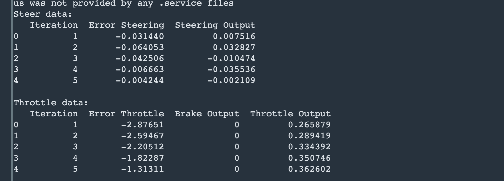
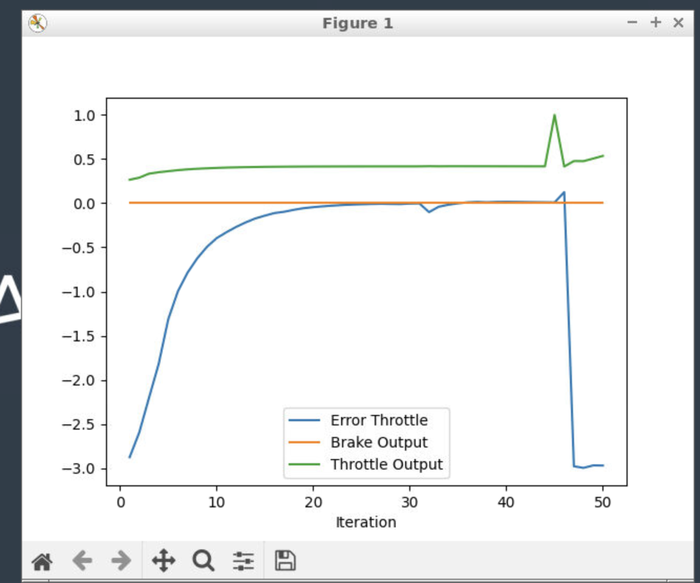
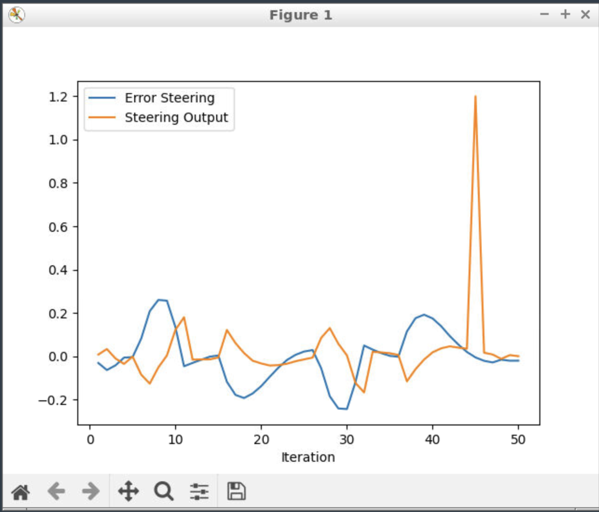

# Writeup: Control and Trajectory Tracking for Autonomous Vehicles

 
 
 
 

## Answer the following questions:

// Add the plots to your report and explain them (describe what you see)
// What is the effect of the PID according to the plots, how each part of the PID affects the control command?
// How would you design a way to automatically tune the PID parameters?
// PID controller is a model free controller, i.e. it does not use a model of the car. Could you explain the pros and cons of this type of controller?
// (Optional) What would you do to improve the PID controller?

 
 
 
 

## Add the plots to your report and explain them (describe what you see)

 
 
 
 

### Step 1 Build the PID controller object

 
 

After step1, the car does not move

 
 
 
 

### Step 2 and 3: PID controller for throttle and Steer:

 
 

 
 

 
 

Treid different paramters for the pid controls. Tried different values for the different pid coefficients.
Tried many different runs for the parameters.
The car does reasonanly well to avoid collision with all the cars and drive a reasonable distance before sometimes finally colliding with the wall on the right and fewtimes with tree on the left.

 
 

### Step 4 : Evaluate the PID efficiency

 
 

 
 

Regarding the throttle - Blue color represents the error throttle and green the throttle ouput at that iteration. In the initial iterations (till about iteration 10) the error is more, as the car tries to build up speed. From about 10 iterations to 45 iterations, the pid control does well and the error is less. The error is close to zero for these iterations with error values like -0.00963955, 0.00973863.  After iteration 45, the error increases much more.

Regarding the Speed - Blue color represents the steering error and orange the steering ouput at that iteration. The overall pattern of error follows a zig zag pattern. Overall the error is less for most of the iterations. 
For iterations between 10 to 15, the error is very less with error values like 0.00313678, -0.00224078. Similarly error is less around iteration 24-27. These are probably the situations where the car was able to steer away from other cars and avoid collission.

 
 
 
 

## What is the effect of the PID according to the plots, how each part of the PID affects the control command?
 
 

PID Controller has 3 parts which influence the trajectory. The 3 components are Proportional, derivative and Integral.

 
 
Proportional : The proportional part influences based on the difference between the current value and desired target which we can call the crosstrack error. The coefficient KP/tau_p correponds to this. Increasing the value of this coefficient tries to reduce the error faster.  But if it increases too much, it causes higher throttle and more acute steering and causes collision.
It can cause overshoots. As we can see from our example simulations, we can see higher vales of this leads to more oscillations and collisions.
 
 

Integral : The integral part considers all the previous values of the crosstrack error and integrates it over the entire time.
The coefficient KI/tau_i correponds to this. (int_cte += cte * delta_time) This usually acts to reduce the systemic drifts. Since this takes the historial cumulative errors in to account, the coefficient leads to more stabliziation of the trajectory. 
 
 

Derivative : The derivate part considers the 'rate of change of error'. It considers the difference between current error and the previous error. The coefficient KD/tau_d correponds to this. (cte - prev_cte)/delta_time. This helps the controller realize that the error is reducing with respect to time and this helps to gracefully move towards the target. As we can see from our example simulations, this helps the car to maintain a lane after passing over another vehicle and doing a steer. It helps to avoid overshoots.  
 
 
 
 

## How would you design a way to automatically tune the PID parameters?
 
 
As explained in the lesson, we can use algorithms like twiddle. We can find which paramerters produce minimal average crosstrack error.

 
 
 
 

##  PID controller is a model free controller, i.e. it does not use a model of the car. Could you explain the pros and cons of this type of controller?
 
 
### pros
 
 
Since the math is relatively simple, its easier to implement.
By trying out different parameters(manually or twiddle), its easier to get decent performance.
Intuition is easier to follow for building small projects like building prototype trajectories.
Algorithm runs fast.
 
 
### cons
 
 
In real life situations, model of the car might play a meaningful role in determining the trajectory. so, not using that information might limit the performance.
Using more model related paramerters could improve the stability of the trajectories.
 
 
 
 

